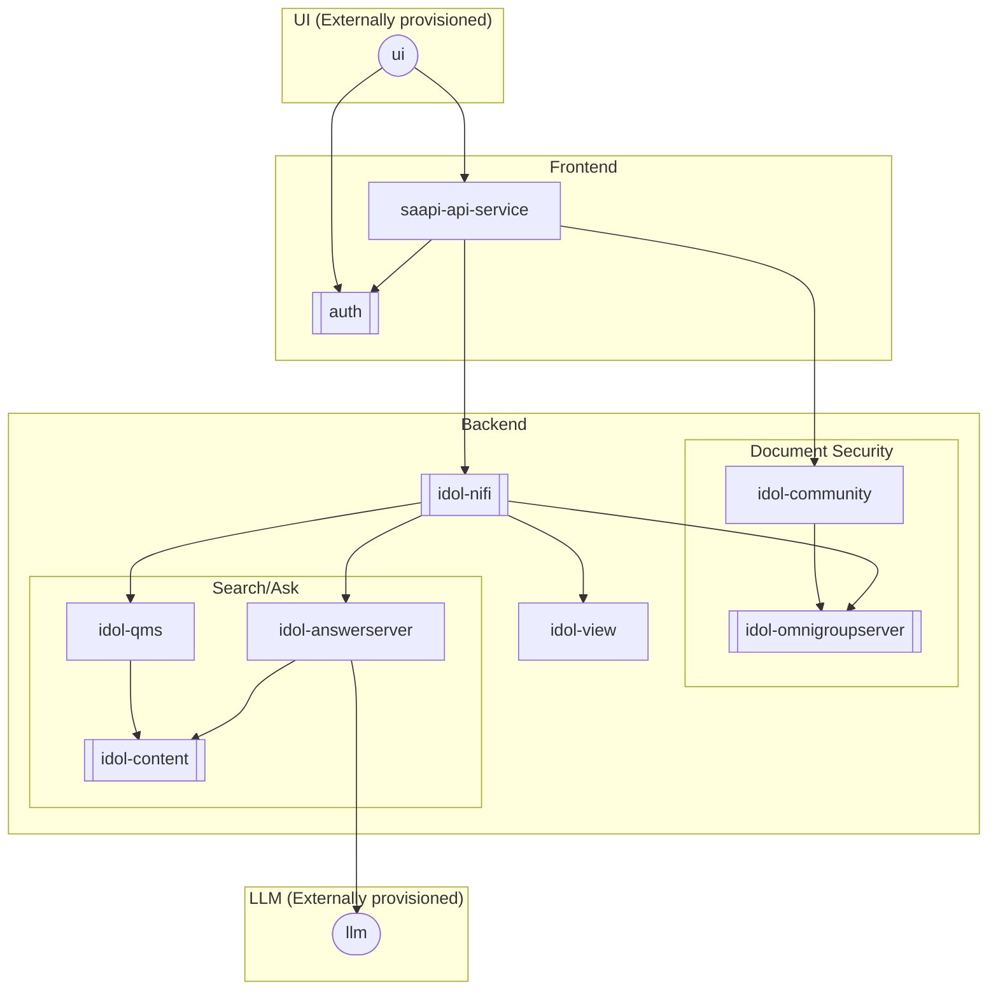

# search-abstractor-stack

 

Provides an IDOL setup for Retrieval-augmented generation (RAG)

## Requirements

| Repository | Name | Version |
|------------|------|---------|
| https://raw.githubusercontent.com/opentext-idol/discover-deploy/develop/helm | auth(discover-auth) | 0.1.0 |
| https://raw.githubusercontent.com/opentext-idol/idol-containers-toolkit/main/helm | answerserver(idol-answerserver) | 0.2.0 |
| https://raw.githubusercontent.com/opentext-idol/idol-containers-toolkit/main/helm | community(idol-community) | 0.5.0 |
| https://raw.githubusercontent.com/opentext-idol/idol-containers-toolkit/main/helm | nifi(idol-nifi) | 0.5.0 |
| https://raw.githubusercontent.com/opentext-idol/idol-containers-toolkit/main/helm | ogs(idol-omnigroupserver) | 0.6.0 |
| https://raw.githubusercontent.com/opentext-idol/idol-containers-toolkit/main/helm | qms(idol-qms) | 0.4.0 |
| https://raw.githubusercontent.com/opentext-idol/idol-containers-toolkit/main/helm | view(idol-view) | 0.4.0 |
| https://raw.githubusercontent.com/opentext-idol/idol-containers-toolkit/main/helm | content(single-content) | 0.9.0 |

### Licensing

You must have a valid [IDOL LicenseServer](https://www.microfocus.com/documentation/idol/IDOL_24_3/LicenseServer_24.3_Documentation/Help/Content/Introduction/Introduction.htm) running to license the IDOL services.

To allow the services to communicate with the LicenseServer, use one of the following options:

- Configure and install the [idol-licenseserver](https://github.com/opentext-idol/idol-containers-toolkit/tree/main/helm/idol-licenseserver) chart
 (which provides an idol-licenseserver Kubernetes service that proxies to your actual LicenseServer instance)
- Set the `licenseServerHostname` value in each of the subchart values, for example `--set content.licenseServerHostname=my.license.server.instance`

### Pull Secrets

To pull the container images from the `microfocusidolserver` repository, you need a preexisting `kubernetes.io/dockerconfigjson` Secret with your credentials.

You can create an appropriate secret (for example called `dockerhub-secret`) by using the following command:

```bash
kubectl create secret docker-registry dockerhub-secret --docker-server=https://index.docker.io/v1/ --docker-username=microfocusidolreadonly --docker-password=<your-apikey>
```

For more details, see the [Kubernetes documentation](https://kubernetes.io/docs/tasks/configure-pod-container/pull-image-private-registry/#create-a-secret-by-providing-credentials-on-the-command-line).

## Installation

To install the chart with the release name `my-release`, using customized [values](#values) from `my-values.yaml`, use the following command:

```bash
# Add this repository as 'idol-search-abstractor' (can change this name)
helm repo add idol-search-abstractor https://raw.githubusercontent.com/opentext-idol/search-abstractor/main/helm

# Actually install the chart
helm install -f my-values.yaml my-release idol-search-abstractor/search-abstractor-stack
```

## Architecture Diagram

The following diagram shows the relationships between the Deployments/StatefulSets provisioned by the chart.



## Values

 > For more detailed configuration, refer to the documentation for each of the subcharts (links provided in the values table below).

### Global Values

| Key | Type | Default | Description |
|-----|------|---------|-------------|
| global.idolVersion | string | `"24.3.0"` | Global override value for idolImage.version |
| global.imagePullSecrets | list | `["dockerhub-secret"]` | Global secrets used to pull container images |

### Other Values

| Key | Type | Default | Description |
|-----|------|---------|-------------|
| aes.key | string | `"search-abstractor"` | Value used to generate a shared AES256 key for securityinfo |
| answerserver | object | default configuration for search-abstractor answerserver | `answerserver` subchart values (see https://github.com/opentext-idol/idol-containers-toolkit/tree/main/helm/idol-answerserver#values) |
| answerserver.enabled | bool | `true` | Whether to deploy an Answer Server component |
| auth | object | default configuration for search-abstractor auth | `auth` subchart values (see https://github.com/opentext-idol/discover-deploy/tree/refactor/auth/helm/discover-auth#values) |
| auth.apiClient | string | `"discover_api"` | Client to configure and use for API requests |
| auth.apiClientSecret | string | `"d0e76ad7-7d6b-4d86-be3a-5dfe715dbf87"` | Client credentials to configure and use for API requests |
| auth.baseRealmRoles | string | `"role1,role2,role3"` | Roles to populate in keycloak |
| auth.enabled | bool | `true` | Whether to deploy the `discover-auth` subchart |
| auth.realm | string | `"discover"` | Realm |
| auth.tokenExpiryTimeSeconds | int | `600` | Expiration time in seconds for login tokens |
| auth.uiClient | string | `"discover_ui"` | Client to configure and use for logging into the UI |
| auth.uiUrls | string | `"http://localhost:4200/*"` | URL to redirect to post authorization |
| community | object | default configuration for search-abstractor community | `community` subchart values (see https://github.com/opentext-idol/idol-containers-toolkit/tree/main/helm/idol-community#values) |
| community.cfg.security | string | `"0=Autonomy\n// add your community security setup here (appended to [Security] section)"` | Additional Community security configuration data   |
| community.enabled | bool | `true` | Whether to deploy Community component |
| content | object | default configuration for search-abstractor content | `content` subchart values (see https://github.com/opentext-idol/idol-containers-toolkit/tree/main/helm/single-content#values) |
| content.cfg.fieldprocessing | string | "" | Additional Content field processing configuration data |
| content.cfg.security | string | "" | Additional Content security configuration data |
| content.enabled | bool | `true` | Whether to deploy a content component |
| nifi | object | default configuration for search-abstractor nifi | `nifi` subchart values (see https://github.com/opentext-idol/idol-containers-toolkit/tree/main/helm/idol-nifi#values) |
| nifi.enabled | bool | `true` | Whether to deploy a NiFi instance |
| ogs | object | default configuration for search-abstractor omnigroupserver | `omnigroupserver` subchart values (see https://github.com/opentext-idol/idol-containers-toolkit/tree/main/helm/idol-omnigroupserver#values) |
| ogs.cfg.repositories | string | "" | additional omingroupserver repositories configuration data |
| ogs.enabled | bool | `true` | Whether to deploy an OmniGroupServer component |
| qms | object | default configuration for search-abstractor qms | `qms` subchart values (see https://github.com/opentext-idol/idol-containers-toolkit/tree/main/helm/idol-qms#values) |
| qms.enabled | bool | `true` | Whether to deploy a QMS component |
| saapi.allowedOrigins | string | `"http://localhost:8080"` | CORS origin values |
| saapi.backendApi.ingress.className | string | `""` | Optional parameter to override the default ingress class |
| saapi.backendApi.ingress.enabled | bool | `false` | Whether to create a backend API ingress resource |
| saapi.backendApi.ingress.host | string | `""` | Optional host (see https://kubernetes.io/docs/concepts/services-networking/ingress/#ingress-rules). |
| saapi.backendApi.name | string | `"search-abstractor-api"` | Host/service name |
| saapi.backendApi.port | int | `8085` | Port |
| saapi.backendIdolHost | string | `"idol-community"` | Hostname for Community component |
| saapi.backendIdolPort | string | `"9030"` | ACI port for Community component |
| saapi.config | string | `"api-config"` | `configmap` name |
| saapi.image.pullPolicy | string | `"Always"` | The policy to use to determine whether to pull the specified image (see https://kubernetes.io/docs/concepts/containers/images/#image-pull-policy) |
| saapi.image.registry | string | `"microfocusidolserver"` | The registry value to use to construct the container image name: {registry}/{repo}:{version} |
| saapi.image.repo | string | `"search-abstractor-api-service"` | The repository value to use to construct the container image name: {registry}/{repo}:{version} |
| saapi.image.version | string | `"24.3.0"` | The version value to use to construct the container image name: {registry}/{repo}:{version} |
| saapi.ingress.className | string | `""` | Optional parameter to override the default ingress class |
| saapi.ingress.host | string | `""` | Optional ingress host (see https://kubernetes.io/docs/concepts/services-networking/ingress/#ingress-rules). |
| saapi.ingress.path | string | `"/api/"` | Ingress controller path exposing api |
| saapi.name | string | `"saapi-api-service"` | deployment name |
| saapi.replicas | int | `1` | deployment replicas |
| saapi.secret | string | `"api-secret"` | Secret name for auth credentials |
| saapi.service.name | string | `"saapi-api-service"` | Service name |
| saapi.service.port | int | `8080` | Port service runs on |
| saapi.vllm.HFToken | string | `""` | HuggingFace token to access the model/tokenizer to use for the RAG answer system |
| saapi.vllm.endpoint | string | `"http://vllm-endpoint:8000/v1/completions"` | vllm endpoint to use for llm access |
| saapi.vllm.model | string | `"mistralai/Mistral-7B-Instruct-v0.2"` | The LLM to use |
| saapi.vllm.modelRevision | string | `"9925900"` | The LLM revision to use (branch, tag, or commitid) |
| view | object | default configuration for search-abstractor view | `view` subchart values (see https://github.com/opentext-idol/idol-containers-toolkit/tree/main/helm/idol-view#values) |
| view.enabled | bool | `true` | Whether to deploy a View component |

----------------------------------------------
Autogenerated from chart metadata using [helm-docs v1.14.2](https://github.com/norwoodj/helm-docs/releases/v1.14.2)
