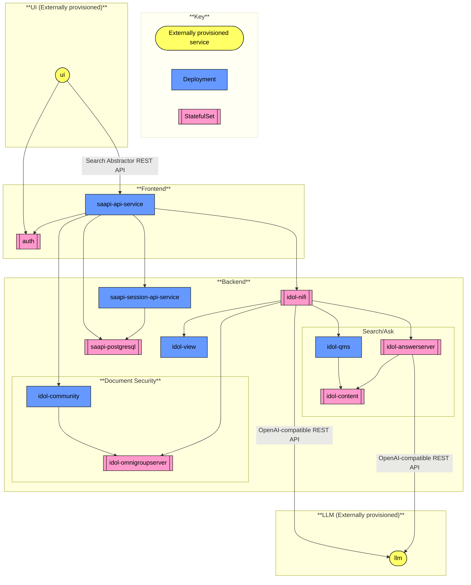

# search-abstractor-stack

 

Provides an IDOL setup for Retrieval-augmented generation (RAG)

## Requirements

| Repository | Name | Version |
|------------|------|---------|
| @bitnami | otdsdb(postgresql) | 16.2.1 |
| @bitnami | saapiPostgresql(postgresql) | 16.2.1 |
| @substratusai | llavadeployment(vllm) | 0.5.5 |
| @substratusai | vllmdeployment(vllm) | 0.5.5 |
| https://raw.githubusercontent.com/opentext-idol/idol-containers-toolkit/main/helm | distributedidol(distributed-idol) | ~0.13.0 |
| https://raw.githubusercontent.com/opentext-idol/idol-containers-toolkit/main/helm | answerserver(idol-answerserver) | ~0.5.0 |
| https://raw.githubusercontent.com/opentext-idol/idol-containers-toolkit/main/helm | community(idol-community) | ~0.7.0 |
| https://raw.githubusercontent.com/opentext-idol/idol-containers-toolkit/main/helm | idol-library(idol-library) | ~0.15.0 |
| https://raw.githubusercontent.com/opentext-idol/idol-containers-toolkit/main/helm | nifi(idol-nifi) | ~0.15.0 |
| https://raw.githubusercontent.com/opentext-idol/idol-containers-toolkit/main/helm | ogs(idol-omnigroupserver) | ~0.8.0 |
| https://raw.githubusercontent.com/opentext-idol/idol-containers-toolkit/main/helm | qms(idol-qms) | ~0.7.0 |
| https://raw.githubusercontent.com/opentext-idol/idol-containers-toolkit/main/helm | view(idol-view) | ~0.7.0 |
| https://raw.githubusercontent.com/opentext-idol/idol-containers-toolkit/main/helm | content(single-content) | ~0.11.0 |
| https://registry.opentext.com/helm | auth(otds) | 24.4.0 |

### Prerequisites

- [Kubernetes](https://kubernetes.io/) cluster
- [helm](https://github.com/helm/helm/releases) command line tool
- [kubectl](https://kubernetes.io/releases/download/) command line tool

### Licensing

You must have a valid [IDOL LicenseServer](https://www.microfocus.com/documentation/idol/IDOL_24_4/LicenseServer_24.4_Documentation/Help/Content/Introduction/Introduction.htm) running to license the IDOL services.

To allow the services to communicate with the LicenseServer, use one of the following options:

- Configure and install the [idol-licenseserver](https://github.com/opentext-idol/idol-containers-toolkit/tree/main/helm/idol-licenseserver) chart
 (which provides an idol-licenseserver Kubernetes service that proxies to your actual LicenseServer instance)
- Set the `licenseServerHostname` value in each of the subchart values, for example `--set content.licenseServerHostname=my.license.server.instance`

### Pull Secrets

To pull the container images from the `microfocusidolserver` repository, you need a preexisting `kubernetes.io/dockerconfigjson` Secret with your credentials.

You can create an appropriate secret (for example called `dockerhub-secret`) by using the following command:

```bash
kubectl create secret docker-registry dockerhub-secret --docker-server=https://index.docker.io/v1/ --docker-username=microfocusidolreadonly --docker-password=<your-apikey>
```

For more details, see the [Kubernetes documentation](https://kubernetes.io/docs/tasks/configure-pod-container/pull-image-private-registry/#create-a-secret-by-providing-credentials-on-the-command-line).

## Installation

To install the chart with the release name `my-release`, using customized [values](#values) from `my-values.yaml`, use the following command:

```bash
# Add this repository as 'idol-search-abstractor' (can change this name)
helm repo add idol-search-abstractor https://raw.githubusercontent.com/opentext-idol/search-abstractor/main/helm

# Actually install the chart
helm install -f my-values.yaml my-release idol-search-abstractor/search-abstractor-stack

# Add supplementary repositories as needed
helm repo add bitnami https://charts.bitnami.com/bitnami
helm repo add substratusai https://substratusai.github.io/helm
```

### Common Setup

Search Abstractor makes use of Helm charts provided by [opentext-idol/idol-containers-toolkit](https://github.com/opentext-idol/idol-containers-toolkit/tree/main/helm) and as such shares many [common setup](https://github.com/opentext-idol/idol-containers-toolkit/tree/main/helm#common-setup) considerations.

In particular the following are expected to be particular to individual cluster setups:

- [Licensing](#licensing)
- Storage (provisioning of PersistentVolumes for StatefulSets)
- Ingress (providing access to the services)
- Connectors and Document Security

[custom.values.yaml](./custom.values.yaml) provides a useful starting point for specifying these. Refer to [values](#values) for full configuration options.

## Architecture Diagram

The following diagram shows the relationships between the Deployments/StatefulSets provisioned by the chart.


```mermaid
flowchart TB
  direction TB
  subgraph Key[**Key**]
    ext(["Externally provisioned service"]):::c_ext
    dep[Deployment]:::c_dep
    ss[[StatefulSet]]:::c_set
  end
  subgraph "**UI (Externally provisioned)**"
    direction TB
    ui(["  ui  "]):::c_ext
  end
  subgraph **Frontend**
    direction LR
    api[saapi-api-service]:::c_dep
    auth[[auth]]:::c_set
  end
  subgraph **Backend**
    idol-nifi[[idol-nifi]]:::c_set
    saapi-session-api-service:::c_dep
    saapi-postgresql[[saapi-postgresql]]:::c_set
    idol-view:::c_dep
    subgraph Search/Ask
      idol-answerserver[[idol-answerserver]]:::c_set
      idol-qms:::c_dep
      idol-content[[idol-content]]:::c_set
    end
    subgraph **Document Security**
      direction LR
      idol-community:::c_dep
      idol-omnigroupserver[[idol-omnigroupserver]]:::c_set
    end
  end
  subgraph "**LLM (Externally provisioned)**"
    space[ ]
    llm([llm]):::c_ext
  end

ui -->|Search Abstractor REST API|api
ui --> auth
api --> auth
api ---> idol-nifi
api ----> idol-community
idol-community --> idol-omnigroupserver
idol-nifi ----> idol-omnigroupserver
idol-nifi --> idol-qms
idol-nifi --> idol-answerserver
idol-nifi --> idol-view
idol-nifi -->|OpenAI-compatible REST API| llm
idol-qms --> idol-content
idol-answerserver --> idol-content
idol-answerserver ----->|OpenAI-compatible REST API| llm
api --> saapi-postgresql
api --> saapi-session-api-service
saapi-session-api-service --> saapi-postgresql
space ~~~ llm

style space fill:#FFFFFF00, stroke:#FFFFFF00,height:1x,width:1px;
style Key opacity:0.3;

classDef c_ext stroke:#000000,fill:#ffff66,color:#000000;
classDef c_dep stroke:#000000,fill:#6699ff,color:#000000;
classDef c_set stroke:#000000,fill:#ff99cc,color:#000000;

```

## Values

 > For more detailed configuration, refer to the documentation for each of the subcharts (links provided in the values table below).

### Global Values

| Key | Type | Default | Description |
|-----|------|---------|-------------|
| global.imagePullSecrets | list | `["dockerhub-secret"]` | Global secrets used to pull container images |

### Other Values

| Key | Type | Default | Description |
|-----|------|---------|-------------|
| aes.key | string | `"search-abstractor"` | Value used to generate a shared AES256 key for securityinfo |
| answerserver | object | default configuration for search-abstractor answerserver | `answerserver` subchart values (see https://github.com/opentext-idol/idol-containers-toolkit/tree/main/helm/idol-answerserver#values) |
| answerserver.answerbank.enabled | bool | `false` | whether to enable answerbank answer system. See also answerserver.answserbankAgentstore.enabled. |
| answerserver.answerbankAgentstore.enabled | bool | `false` | whether to enable backing agentstore for answerbank answer system. See also answerserver.answserbankAgentstore.enabled. |
| answerserver.enabled | bool | `true` | Whether to deploy an Answer Server component |
| answerserver.factbank.codingsPsqlConnectionString | string | `""` | Connection string for factbank codings postgres database - set if you want to use a separate external database for codings |
| answerserver.factbank.enabled | bool | `false` | whether to enable factbank answer system. See also answerserver.postgresql.enabled. |
| answerserver.factbank.psqlConnectionString | string | `""` | Connection string for factbank postgres database - set if you want to use an external database rather than deploy one here |
| answerserver.postgresql.enabled | bool | `false` | whether to enable backing postgresl for factbank answer system. See also answerserver.factbank.enabled. |
| auth | object | default configuration for auth service | auth service values |
| auth.apiClient | string | `"discover_api"` | Client to use for API requests. Configured using OTDS creds if not existing (see auth.otdsws.adminEmail/adminPassword) |
| auth.apiClientSecret | string | `"d0e76ad7-7d6b-4d86-be3a-5dfe715dbf87"` | Client credentials for API requests. Configured using OTDS creds if not existing (see auth.otdsws.adminEmail/adminPassword) |
| auth.baseRealmRoles | string | `"user"` | Roles to populate in OTDS |
| auth.createAdminPassword | string | `"admin.user.123!"` | password for Discover administrator user to create as part of system initialization |
| auth.createAdminUsername | string | `"admin.user"` | Discover administrator user to create as part of system initialization |
| auth.enabled | bool | `true` | whether to deploy OTDS component If you are not deploying OTDS here, you still need to configure values as if it was being deployed and set this to false |
| auth.external.host | string | `nil` | External hostname for OTDS instance (e.g. host.name) |
| auth.external.port | string | `nil` | External port number of OTDS instance (e.g. 8080) |
| auth.external.protocol | string | `"http"` | Protocol for OTDS communication (http/https) |
| auth.initEnabled | bool | `true` | Whether to initialize OTDS with the partition and clients |
| auth.ogsClient | string | `"otds-ogs-client"` | Client to use for OGS requests. Should be created in advance by an OTDS admin. |
| auth.ogsClientSecret | string | `""` | Client credentials for OGS requests. Should be provided by the OTDS admin after creating the OGS client. |
| auth.otdsws | object | See also OTDS chart default values | OTDS sub chart values |
| auth.otdsws.ingress.prependPath | string | `"OTDS"` | Ingress prefix for OTDS. e.g. eventually resolves as proto://host.name:port/prependPath/otdsws |
| auth.partition | string | `"discover"` | partition in the authentication server to configure and use |
| auth.refreshTokenExpiryTimeSeconds | int | `86400` | Expiry time in seconds for refresh tokens |
| auth.simplePasswordPolicy | bool | `false` | if true removes restrictions on password strength only for use in testing |
| auth.tokenExpiryTimeSeconds | int | `300` | Expiry time in seconds for login tokens |
| auth.uiClient | string | `"discover_ui"` | Client to configure and use for logging into the UI |
| auth.uiUrls | string | `"http://localhost:4200/.*"` | URL to redirect to post authorization |
| auth.userSecurity.jwtUserField | string | `"name"` | Field from decoded JWT for Community to compare against username |
| auth.userSecurity.repository | string | `"OTDS"` | Security Repository in Community to use for UserRead authentication |
| auth.userSecurity.resourceId | string | `""` | OTDS Resource ID to supply on UserRead authentication requests |
| auth.usersFile | string | `""` | Optional path to file to populate additional users from |
| community | object | default configuration for search-abstractor community | `community` subchart values (see https://github.com/opentext-idol/idol-containers-toolkit/tree/main/helm/idol-community#values) |
| community.cfg.otds | string | `"// add you OTDS security settings here (appended to [OTDS] section)"` | Additional OTDS security repository settings |
| community.cfg.overwrite | bool | `false` | Set to `true` to completely overwrite default [Security] settings |
| community.cfg.security | string | `"// add your community security setup here (appended to [Security] section)"` | Additional Community security configuration data |
| community.enabled | bool | `true` | Whether to deploy Community component |
| content | object | default configuration for search-abstractor content | `content` subchart values (see https://github.com/opentext-idol/idol-containers-toolkit/tree/main/helm/single-content#values) |
| content.cfg.fieldprocessing | string | "" | Additional Content field processing configuration data |
| content.cfg.security | string | "" | Additional Content security configuration data |
| content.enabled | bool | `true` | Whether to deploy a content component |
| distributedidol | object | default configuration for search-abstractor distributed-idol | `distributed-idol` subchart values (see https://github.com/opentext-idol/idol-containers-toolkit/tree/main/helm/distributed-idol#values) |
| distributedidol.enabled | bool | `false` | Whether to deploy a distributed-idol component (either this or content should be enabled, but not both) |
| llavadeployment | object | default configuration for search-abstractor Llava deployment | VLLM subchart values (see https://github.com/substratusai/helm/blob/main/charts/vllm/README.md) - not enabled by default |
| nifi | object | default configuration for search-abstractor nifi | `nifi` subchart values (see https://github.com/opentext-idol/idol-containers-toolkit/tree/main/helm/idol-nifi#values) |
| nifi.enabled | bool | `true` | Whether to deploy a NiFi instance |
| ogs | object | default configuration for search-abstractor omnigroupserver | `omnigroupserver` subchart values (see https://github.com/opentext-idol/idol-containers-toolkit/tree/main/helm/idol-omnigroupserver#values) |
| ogs.cfg.otds | string | `"// appended to the [OTDS] repository configuration section"` | additional OTDS configuration data |
| ogs.cfg.overwrite | bool | `false` | Set to `true` to completely overwrite default [Repositories] settings |
| ogs.cfg.repositories | string | `"// add your OmniGroupServer repo setup here (appended to [Repositories] section)\n// start numbering at 1=... unless overwriting (0 is the OTDS repository config)"` | additional omnigroupserver repositories configuration data |
| ogs.enabled | bool | `true` | Whether to deploy an OmniGroupServer component |
| otdsdb | object | default configuration for OTDS PostgreSQL | PostgreSQL subchart for OTDS. (see https://github.com/bitnami/charts/tree/main/bitnami/postgresql) |
| qms | object | default configuration for search-abstractor qms | `qms` subchart values (see https://github.com/opentext-idol/idol-containers-toolkit/tree/main/helm/idol-qms#values) |
| qms.enabled | bool | `true` | Whether to deploy a QMS component |
| saapi.additionalVolumeMounts | object | `{}` | Additional PodSpec VolumeMount(s) (see <https://kubernetes.io/docs/reference/kubernetes-api/workload-resources/pod-v1/#volumes-1>) Typical usage might be to mount in custom TLS certificates dict of (name, VolumeMount) |
| saapi.additionalVolumes | object | `{}` | Additional PodSpec Volume(s) (see <https://kubernetes.io/docs/reference/kubernetes-api/workload-resources/pod-v1/#volumes>) Typical usage might be to mount in custom TLS certificates dict of (name, Volume) |
| saapi.allowedOrigins | string | `"http://localhost:8080"` | CORS origin values |
| saapi.backendApi.ingress.className | string | `""` | Optional parameter to override the default ingress class |
| saapi.backendApi.ingress.enabled | bool | `false` | Whether to create a backend API ingress resource. Neither recommended nor required in normal operation. |
| saapi.backendApi.ingress.host | string | `""` | Optional host (see https://kubernetes.io/docs/concepts/services-networking/ingress/#ingress-rules). |
| saapi.backendApi.name | string | `"idol-nifi"` | Host/service name. Should point at query nifi service |
| saapi.backendApi.port | int | `8085` | Port |
| saapi.backendIdolContentHost | string | `"idol-qms"` | hostname for Content component |
| saapi.backendIdolContentPort | string | `"16000"` | aci port for content component |
| saapi.backendIdolHost | string | `"idol-community"` | Hostname for Community component |
| saapi.backendIdolPort | string | `"9030"` | ACI port for Community component |
| saapi.config | string | `"api-config"` | `configmap` name |
| saapi.httpCacheMaxAge | int | `3600` | Cache duration, in seconds, for document images and subfiles |
| saapi.image.pullPolicy | string | `"Always"` | The policy to use to determine whether to pull the specified image (see https://kubernetes.io/docs/concepts/containers/images/#image-pull-policy) |
| saapi.image.registry | string | `"microfocusidolserver"` | The registry value to use to construct the container image name: {registry}/{repo}:{version} |
| saapi.image.repo | string | `"search-abstractor-api-service"` | The repository value to use to construct the container image name: {registry}/{repo}:{version} |
| saapi.image.version | string | `"25.2.4"` | The version value to use to construct the container image name: {registry}/{repo}:{version} |
| saapi.ingress.className | string | `""` | Optional parameter to override the default ingress class |
| saapi.ingress.host | string | `""` | Optional ingress host (see https://kubernetes.io/docs/concepts/services-networking/ingress/#ingress-rules). |
| saapi.ingress.path | string | `"/api/"` | Ingress controller path exposing API (should end with /) |
| saapi.ingress.port | int | `12080` | Port ingress service runs on |
| saapi.javaOpts | string | `""` |  |
| saapi.management.basePath | string | `"/actuator/"` | base path for management functions; e.g. healthcheck (must begin and end with a slash) |
| saapi.name | string | `"saapi-api-service"` | Deployment name |
| saapi.replicas | int | `1` | Deployment replicas |
| saapi.resources | object | `{"enabled":false,"limits":{"cpu":"200m","memory":"1Gi"},"requests":{"cpu":"200m","memory":"1Gi"}}` | Optional resources for Search Abstractor API container (see https://kubernetes.io/docs/concepts/configuration/manage-resources-containers) |
| saapi.resources.enabled | bool | `false` | enable resources for Search Abstractor API container. Setting to false disables this. |
| saapi.secret | string | `"api-secret"` | Secret name for auth credentials |
| saapi.security.trustedCertsPath | string | `""` | Optional path within the container to load trusted TLS certificates from |
| saapi.service.managePort | int | `8081` | Port service runs on for management |
| saapi.service.name | string | `"saapi-api-service"` | Service name |
| saapi.service.port | int | `8080` | Port service runs on |
| saapi.storage.dbName | string | `"resourcesdb"` | Database name used for api-service storage |
| saapi.storage.maxFileSize | string | `"10MB"` | Maximum size for a single uploaded file |
| saapi.storage.maxRequestSize | string | `"10MB"` | Maximum total size for a request |
| saapi.usingDiscoverIndex | bool | `false` | are we using the Discover index for document storage? |
| saapi.vertexai.authentication | string | `"credentials"` | How to authenticate the VertexAI client with Google Cloud; can be "serviceAccount" or "credentials" |
| saapi.vertexai.credentials | object | `{"auth_provider_x509_cert_url":"https://www.googleapis.com/oauth2/v1/certs","auth_uri":"https://accounts.google.com/o/oauth2/auth","client_email":"","client_id":"","client_x509_cert_url":"https://www.googleapis.com/robot/v1/metadata/x509/svc-vertex-aviator%40otl-csd-architecture.iam.gserviceaccount.com","private_key":"","private_key_id":"","project_id":"","token_uri":"https://oauth2.googleapis.com/token","type":"service_account","universe_domain":"googleapis.com"}` | Application credentials for VertexAI client API calls, used if `authentication` is "credentials". Will be used to initialize a Google service account Credentials instance; see https://google-auth.readthedocs.io/en/master/reference/google.oauth2.service_account.html#google.oauth2.service_account.Credentials.from_service_account_file |
| saapi.vertexai.enabled | bool | `false` | Should we use VertexAI, rather than vLLM, for LLM support? |
| saapi.vertexai.location | string | `"us-east4"` | Location for VertexAI client to use for API calls |
| saapi.vertexai.maxOutputTokens | int | `500` | Limit the number of output tokens returned by the Generative model |
| saapi.vertexai.model | string | `"gemini-1.5-flash-001"` | Name of generative model to use with VertexAI |
| saapi.vertexai.project | string | `"otl-csd-architecture"` | Project name for VertexAI client to use for API calls |
| saapi.vllm.HFToken | string | `""` | HuggingFace token to access the model/tokenizer to use for the RAG answer system |
| saapi.vllm.chatEndpoint | string | `"http://vllm-endpoint:8000/v1/chat/completions"` | vllm chat endpoint to use for llm access |
| saapi.vllm.endpoint | string | `"http://vllm-endpoint:8000/v1/completions"` | vllm endpoint to use for llm access |
| saapi.vllm.llavaEndpointBase | string | `"http://openai-llava-server:8000/v1/"` | The base path of the OpenAI endpoint to use for LLaVa model access |
| saapi.vllm.llavaModel | string | `"llava-hf/llava-v1.6-mistral-7b-hf"` | The LLaVa model to use |
| saapi.vllm.model | string | `"mistralai/Mistral-7B-Instruct-v0.2"` | The LLM to use |
| saapi.vllm.modelRevision | string | `"99259002b41e116d28ccb2d04a9fbe22baed0c7f"` | The LLM revision to use (branch, tag, or commitid) |
| saapi.vllm.openAiApiKey | string | `"My API Key"` | The OpenAI API key to use for the endpoint |
| saapiPostgresql | object | default configuration for search-abstractor session api PostgreSQL | PostgreSQL subchart values (see https://github.com/bitnami/charts/tree/main/bitnami/postgresql) |
| saapiPostgresql.enabled | bool | `true` | Whether to deploy the PostgreSQL subchart for the session api service |
| saapiPostgresql.service.port | int | `5432` | Port session API PostgreSQL service runs on |
| sessionapi.additionalVolumeMounts | object | `{}` | Additional PodSpec VolumeMount(s) (see <https://kubernetes.io/docs/reference/kubernetes-api/workload-resources/pod-v1/#volumes-1>) Typical usage might be to mount in custom TLS certificates dict of (name, VolumeMount) |
| sessionapi.additionalVolumes | object | `{}` | Additional PodSpec Volume(s) (see <https://kubernetes.io/docs/reference/kubernetes-api/workload-resources/pod-v1/#volumes>) Typical usage might be to mount in custom TLS certificates dict of (name, Volume) |
| sessionapi.config | string | `"session-api-config"` | `configmap` name |
| sessionapi.image.pullPolicy | string | `"Always"` | The policy to use to determine whether to pull the specified image (see https://kubernetes.io/docs/concepts/containers/images/#image-pull-policy) |
| sessionapi.image.registry | string | `"microfocusidolserver"` | The registry value to use to construct the container image name: {registry}/{repo}:{version} |
| sessionapi.image.repo | string | `"search-abstractor-session-service"` | The repository value to use to construct the container image name: {registry}/{repo}:{version} |
| sessionapi.image.version | string | `"25.2.4"` | The version value to use to construct the container image name: {registry}/{repo}:{version} |
| sessionapi.ingress.className | string | `""` | Optional parameter to override the default ingress class |
| sessionapi.ingress.enabled | bool | `false` | Whether to create an ingress resource |
| sessionapi.ingress.host | string | `""` | Optional ingress host (see https://kubernetes.io/docs/concepts/services-networking/ingress/#ingress-rules). |
| sessionapi.ingress.path | string | `"/session-api/"` | Ingress controller path exposing session API |
| sessionapi.licensor.name | string | `"idol-answerserver"` | Session licensor name |
| sessionapi.licensor.port | int | `12000` | Port session licensor runs on |
| sessionapi.name | string | `"saapi-session-api-service"` | Deployment name |
| sessionapi.replicas | int | `1` | Deployment replicas |
| sessionapi.resources | object | `{"enabled":false,"limits":{"cpu":"200m","memory":"1Gi"},"requests":{"cpu":"200m","memory":"1Gi"}}` | Optional resources for Search Abstractor session API container (see https://kubernetes.io/docs/concepts/configuration/manage-resources-containers) |
| sessionapi.resources.enabled | bool | `false` | enable resources for Search Abstractor session API container. Setting to false disables this. |
| sessionapi.secret | string | `"session-api-secret"` | Secret name for auth credentials |
| sessionapi.security.trustedCertsPath | string | `""` | Optional path within the container to load trusted TLS certificates from |
| sessionapi.service.name | string | `"saapi-session-api-service"` | Session service name |
| sessionapi.service.port | int | `8080` | Port that the session service runs on |
| view | object | default configuration for search-abstractor view | `view` subchart values (see https://github.com/opentext-idol/idol-containers-toolkit/tree/main/helm/idol-view#values) |
| view.enabled | bool | `true` | Whether to deploy a View component |
| vllmdeployment | object | default configuration for search-abstractor VLLM deployment | VLLM subchart values (see https://github.com/substratusai/helm/blob/main/charts/vllm/README.md) - not enabled by default |

----------------------------------------------
Autogenerated from chart metadata using [helm-docs v1.14.2](https://github.com/norwoodj/helm-docs/releases/v1.14.2)
